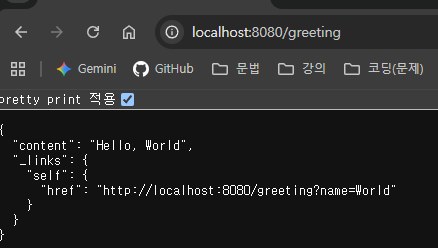
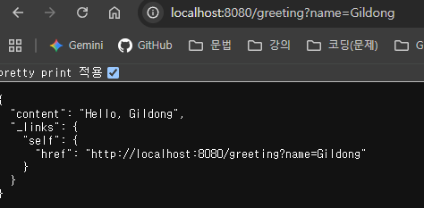

# Spring Guides: Spring Guides: Building a Hypermedia-Driven RESTful Web Service (Spring HATEOAS)

## 1. 만든 것
* **개념**
    * Spring HATEOAS, Spring Boot, Web MVC를 활용
    * 리소스 표현 클래스(DTO)에 자기 참조 링크(_links.self.href) 및 하이퍼미디어 요소를 동적으로 부착하여 반환하는 RESTful API 웹 서비스 구축

* **주요 기능**
    * 리소스 모델링 (Greeting): RepresentationModel<Greeting>을 상속받아 응답 객체에 _links 하이퍼미디어 필드가 자동으로 직렬화되도록 구성
    * 동적 링크 생성 REST Controller (GreetingController): `@RestController`와 `WebMvcLinkBuilder(linkTo(), methodOn())`를 사용하여 컨트롤러 메서드 매핑 정보를 기반으로 현재 요청 URL을 추적하고 self 링크를 생성해 포장
    * 쿼리 파라미터 제어: `@RequestParam(value = "name", defaultValue = "World")`를 사용하여 입력값에 따른 응답 메시지 변환 및 _links.self.href 동적 동기화 처리

---
## 2. 주요 기술 및 문법 (주요 메서드, 파라미터 및 개념 상세)

### 1) Spring HATEOAS & RepresentationModel
* `RepresentationModel<T>` 상속
    *  Spring HATEOAS가 제공하는 기본 표현 클래스
    * 상속 시 객체에 Link를 부착할 수 있는 add() 메서드가 활성화되며 HAL JSON 규격으로 직렬화됨
       
* `WebMvcLinkBuilder (linkTo(), methodOn())`
    * `methodOn(GreetingController.class).greeting(name)`: 실제 로직을 수행하지 않고 컨트롤러의 매핑 정보를 가로채는 가짜 메서드 호출 수행
    * `linkTo(...)`: 가로챈 컨트롤러 매핑 어노테이션을 분석하여 현재 서버 호스트/포트 및 매핑 경로를 조합한 동적 URI를 생성
    * `.withSelfRel()`: 생성된 URI에 relation 타입으로 "self"를 지정하여 Link 객체로 포장

### 2) Jackson 어노테이션과 객체 직렬화/역직렬화
* `@JsonCreator` & `@JsonProperty`
    * Jackson이 객체를 역직렬화(생성)할 때 사용할 생성자와 JSON 키 값을 1:1로 매핑

---
## 3. 핵심 Annotation & 인터페이스 요약
| Annotation / Interface                                      | 설명                                                                                 |
|:------------------------------------------------------------|:-----------------------------------------------------------------------------------|
| **`@RepresentationModel<T>`**                               | Spring HATEOAS의 기본 클래스로, 상속 시 객체에 Link 인스턴스를 추가할 수 있는 add() 메서드 및 _links 포맷팅 기능 제공 |
| **`WebMvcLinkBuilder`**                     | 컨트롤러와 메서드 매핑을 가로채어(methodOn) 하드코딩 없이 동적인 완전한 URI 링크를 빌드해 주는 정적 헬퍼 클래스              |
| `@JsonCreator` / `@JsonProperty`                                       | Jackson 라이브러리가 불변 자바 객체(POJO)를 역직렬화할 때 사용할 생성자 및 JSON 속성 필드 이름을 매핑                 |
| `@RequestParam`                                       | JHTTP 쿼리 스트링 파라미터(?name=...)를 자바 메서드 변수로 바인딩 **`defaultValue`로 기본값 지정 가능**       |

---
## 4. 발생한 문제
### 1) POST/DELETE 요청 시 405 Method Not Allowed 에러 발생
* **원인**

* **해결**

---
## 5. 실행화면
### 1) 기본 인사말 및 self 링크 조회 (curl http://localhost:8080/greeting)

### 2) 쿼리 파라미터 적용 시 동적 링크 변환 조회 (curl http://localhost:8080/greeting?name=Gildong)
